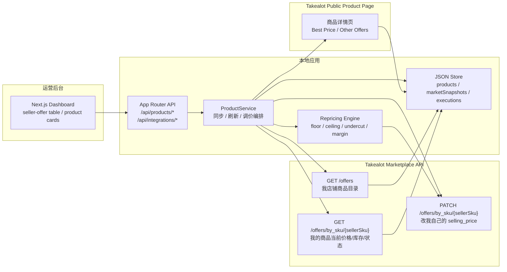
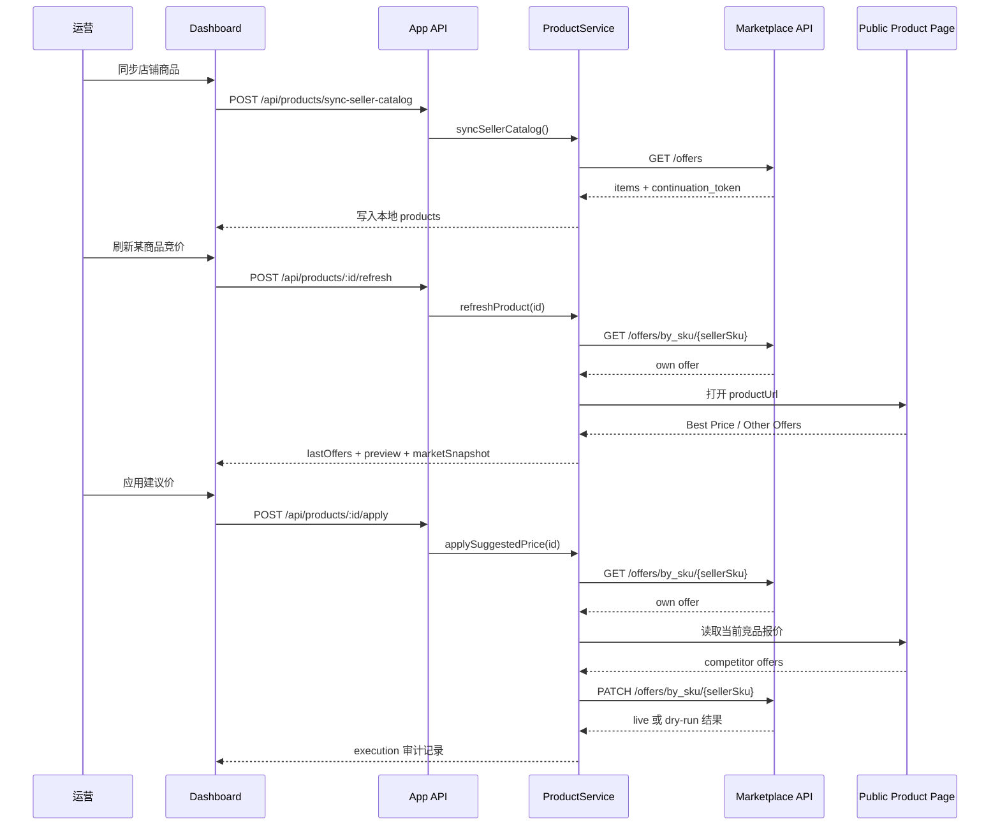

# Marketplace API Repricing Runtime Architecture

## 文档目标

这份文档把当前仓库已经落地的 Takealot 调价流程整理成一份可执行的运行架构说明，重点回答三件事：

- 我店铺商品列表从哪里来
- 竞品最低价从哪里来
- 最终是通过哪条链路改我自己的价格

当前收敛后的结论只有一条主线：

- `Marketplace API /offers` 负责同步我店铺的商品目录
- `Marketplace API /offers/by_sku/{sellerSku}` 负责读取和更新我自己的 offer
- Takealot 前台商品页抓取负责补“竞品最低价 / 其他卖家报价”

`Marketplace API` 当前不被视为“竞品搜索接口”或“平台搜索推荐接口”。

## 总体架构图



## 核心时序



## 模块职责

| 层 | 职责 | 关键文件 |
| --- | --- | --- |
| UI | 展示 seller catalog 表格、商品卡片、设置面板、批量操作入口 | `src/components/dashboard.tsx`, `src/components/seller-offer-table.tsx` |
| 内部 API | 暴露页面动作所需的 HTTP route | `src/app/api/products/*`, `src/app/api/integrations/takealot-seller-api/*` |
| 服务编排 | 负责同步目录、同步 own listing、刷新竞品、应用调价、写快照和审计 | `src/lib/service.ts` |
| 定价引擎 | 根据规则计算建议价和执行预览 | `src/core/repricing.ts` |
| 卖家侧接入 | 对接 Marketplace API，处理 `GET /offers`、`GET/PATCH /offers/by_sku/{sellerSku}` | `src/integrations/takealot-seller-api.ts` |
| 市场侧接入 | 读取前台商品页文本，提取 `Best Price / Other Offers` | `src/integrations/takealot-browser.ts` |
| 运行时装配 | 把 GUI 配置、环境变量和 provider 装配成运行时实例 | `src/lib/runtime.ts`, `src/lib/takealot-seller-api-settings.ts` |
| 本地存储 | 持久化 `products / marketSnapshots / executions` | `src/lib/store.ts`, `data/store.json` |

## 外部接口清单

### 1. Marketplace API

| 接口 | 用途 | 当前实现 | 备注 |
| --- | --- | --- | --- |
| `GET /offers` | 拉取我店铺全部商品目录 | 已接通 | 带 `limit=1000`、`expands=seller_warehouse_stock`，支持 `continuation_token` 分页 |
| `GET /offers/by_sku/{sellerSku}` | 读取单个商品 own offer | 已接通 | 用于同步当前价格、库存、listing 状态 |
| `PATCH /offers/by_sku/{sellerSku}` | 更新我自己的 selling price | 已接通 | 默认 `dry-run`，真实写入前建议单 SKU 验证 |

当前默认协议：

- `baseUrl = https://marketplace-api.takealot.com/v1`
- `auth header = X-API-Key`
- `ownListingPathTemplate = /offers/by_sku/{sellerSku}`

### 2. Takealot 前台商品页

| 入口 | 用途 | 当前实现 | 备注 |
| --- | --- | --- | --- |
| `https://www.takealot.com/<slug>/PLID<productlineId>` | 抓取竞品最低价和其他卖家报价 | 已接通最小实现 | 不是官方 API；依赖 Playwright 持久化 profile、页面可访问性和文案结构稳定 |

当前解析目标：

- `Best Price`
- `Sold by`
- `Other Offers`

## 内部接口清单

### 商品与调价接口

| Method | Route | 作用 | 主要请求体 |
| --- | --- | --- | --- |
| `GET` | `/api/products` | 返回 `products / executions / marketSnapshots` | 无 |
| `POST` | `/api/products/sync-seller-catalog` | 从 Marketplace API 同步店铺商品目录 | 无 |
| `POST` | `/api/products/:id/sync-own-listing` | 同步单商品 own listing | 无 |
| `POST` | `/api/products/sync-own-listings-active` | 批量同步 `active !== false` 商品的 own listing | 无 |
| `POST` | `/api/products/:id/refresh` | 刷新单商品竞品报价并生成 `marketSnapshot` | 无 |
| `POST` | `/api/products/refresh-active` | 批量刷新 `active !== false` 商品竞品报价 | 无 |
| `POST` | `/api/products/:id/apply` | 执行建议价 | 无 |
| `PATCH` | `/api/products/:id/providers` | 修改单商品 `sellerProvider / marketProvider` | `{ "sellerProvider"?, "marketProvider"? }` |
| `PATCH` | `/api/products/:id/settings` | 修改单商品开关配置 | `{ "active"?: boolean }` |
| `PATCH` | `/api/products/:id/rule` | 修改单商品调价规则 | `Partial<RepricingRule>` |
| `PATCH` | `/api/products/:id/manual-market` | 手工录入最低竞品价并刷新建议价 | `{ "sellerName": string, "price": number, "currency"?: "ZAR" }` |

### Seller API 配置接口

| Method | Route | 作用 | 主要请求体 |
| --- | --- | --- | --- |
| `GET` | `/api/integrations/takealot-seller-api/readiness` | 返回 API key、dry-run、协议默认值、风险提示 | 无 |
| `GET` | `/api/integrations/takealot-seller-api/settings` | 返回 GUI 当前配置摘要和 readiness | 无 |
| `PATCH` | `/api/integrations/takealot-seller-api/settings` | 保存 GUI 配置并重置 runtime | `{ apiKey?, baseUrl?, dryRun?, authHeaderName?, authHeaderPrefix?, ownListingPathTemplate?, ...fieldPaths }` |

## 关键数据对象

### `products`

这是当前最核心的数据表，既承载店铺商品目录，也承载调价状态。重点字段包括：

- 目录字段：`title`, `sellerSku`, `offerId`, `tsinId`, `productlineId`, `imageUrl`
- own listing 字段：`currentPrice`, `stockQuantity`, `listingStatus`, `lastSellerSyncAt`
- 市场侧字段：`productUrl`, `lastOffers`, `lastCheckedAt`, `manualMarketSnapshot`
- 调价字段：`rule`, `lastPreview`, `active`

### `marketSnapshots`

只记录市场侧快照，不记录 own listing 同步：

- `productId`
- `marketProvider`
- `offers`
- `preview`
- `capturedAt`
- `source`

### `executions`

记录每次应用建议价的执行审计：

- `previousPrice`
- `suggestedPrice`
- `appliedPrice`
- `status`
- `reason`
- `matchedCompetitor`
- `executedAt`

## 配置与运行前提

### 最小配置

```bash
TAKEALOT_SELLER_API_KEY=...
TAKEALOT_PROFILE_DIR=/absolute/path/to/takealot-browser-profile
```

### 可选配置

```bash
DATA_FILE_PATH=/absolute/path/to/store.json
TAKEALOT_SELLER_API_SETTINGS_FILE_PATH=/absolute/path/to/takealot-seller-api-settings.json
TAKEALOT_SELLER_API_BASE_URL=https://marketplace-api.takealot.com/v1
TAKEALOT_SELLER_API_DRY_RUN=true
TAKEALOT_SELLER_API_AUTH_HEADER_NAME=X-API-Key
TAKEALOT_SELLER_API_OWN_LISTING_PATH_TEMPLATE=/offers/by_sku/{sellerSku}
```

### GUI 设置优先级

当前 Dashboard 已有图形化 Seller API 设置面板。

合并规则如下：

1. 先读环境变量
2. 再读 `data/takealot-seller-api-settings.json`
3. 持久化设置优先覆盖环境变量
4. 保存 GUI 配置后会立即 `reset runtime`

这意味着：

- 你现在不必只靠 `.env` 才能配置 API key
- GUI 支持替换 API key、base URL、header 和字段映射
- API key 在页面上只显示 masked preview，不回填旧明文

## 当前边界与限制

### 已明确支持

- 从 Marketplace API 拉我店铺商品目录
- 读取我自己某个 SKU 的价格、库存、listing 状态
- 对我自己的 SKU 执行 `PATCH` 改价
- 用前台商品页抓取竞品最低价
- 对 seller catalog 列表做显式单行或批量刷新

### 明确不承诺

- Marketplace API 提供平台搜索结果页
- Marketplace API 提供竞品 seller 列表
- Marketplace API 提供 Buy Box / Best Price 市场情报接口
- 页面加载时自动全量抓所有商品竞品价

### 风险点

- 前台竞品抓取依赖 `TAKEALOT_PROFILE_DIR` 对应的登录态和 Cloudflare 可访问性
- 前台商品页 DOM 或文案变化会直接影响抓取稳定性
- `PATCH` 虽已按官方路径接线，但默认仍应保持 `dry-run`
- `title + productline_id` 生成的 public URL 是当前默认策略，必要时应补手工覆盖入口

## 推荐后续扩展

按当前架构继续往下做，优先顺序建议是：

1. 给 seller-offer table 增加 `productUrl` 手工覆盖和校验
2. 把竞品刷新拆成“单行刷新 / 批量刷新 / 缓存过期策略”
3. 在执行链路里补更细的失败原因和重试信息
4. 如果后续拿到官方市场情报能力，再新增独立 provider，不要直接混进 `takealot-seller-api`
